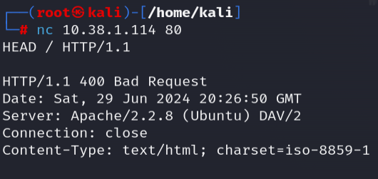
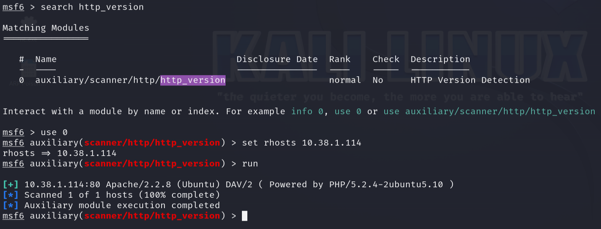
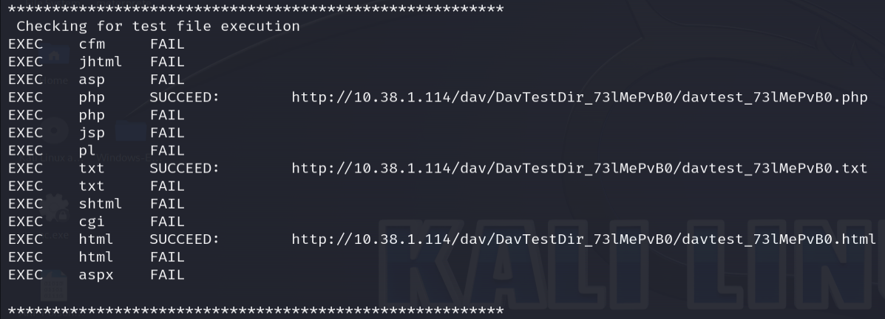
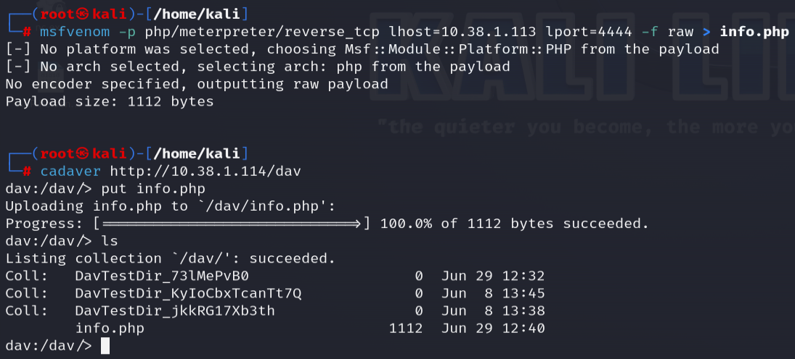
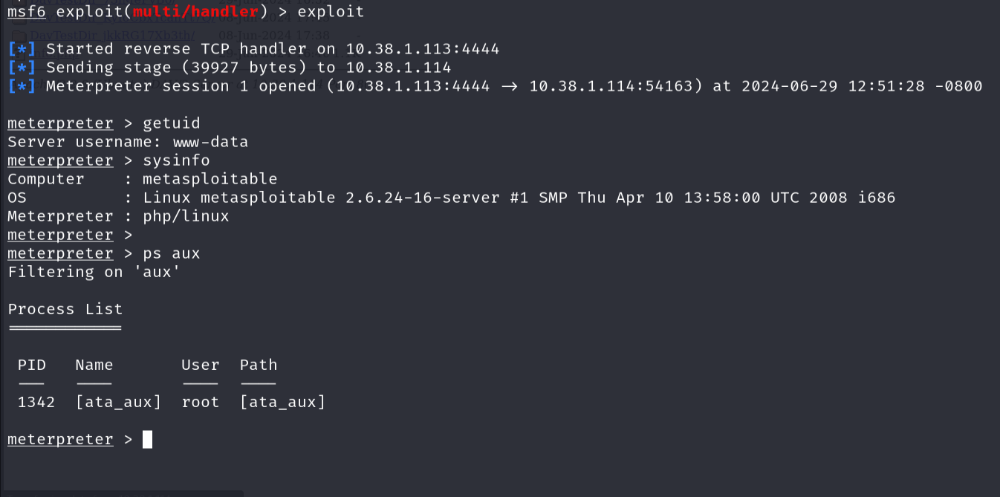
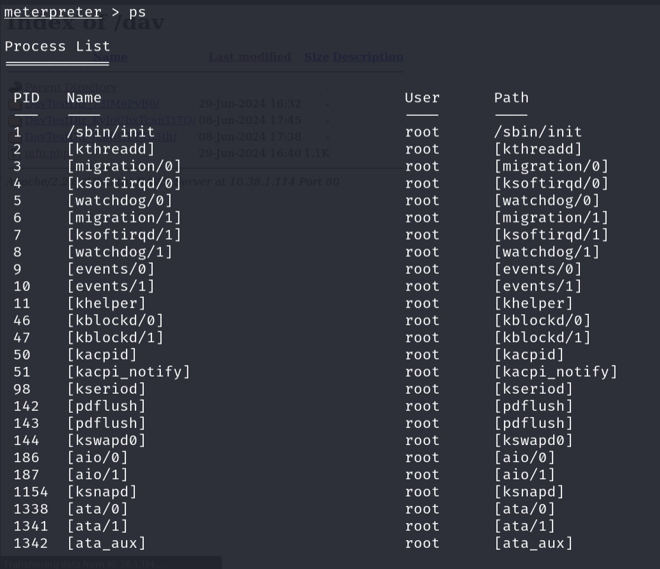
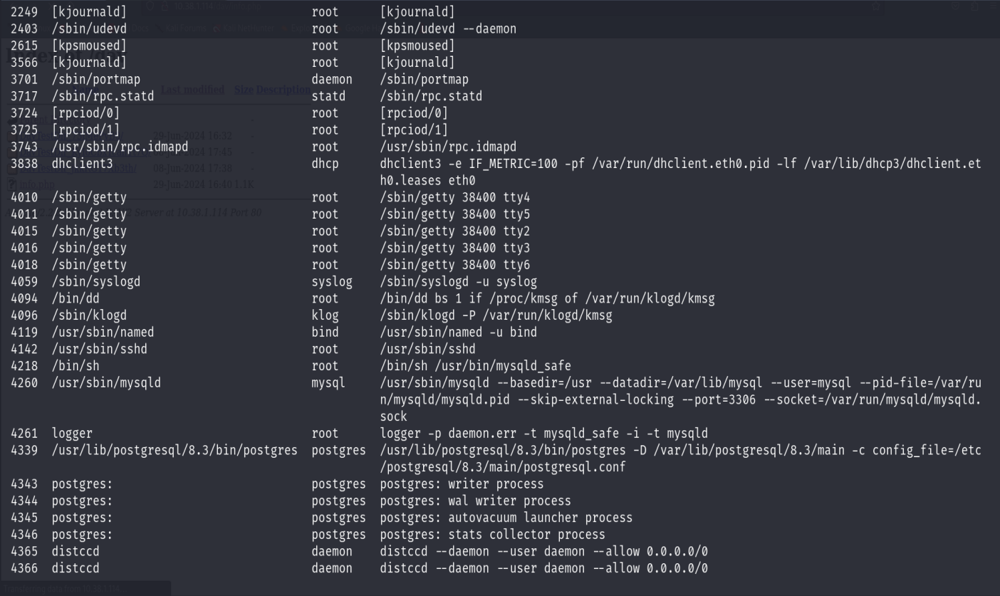
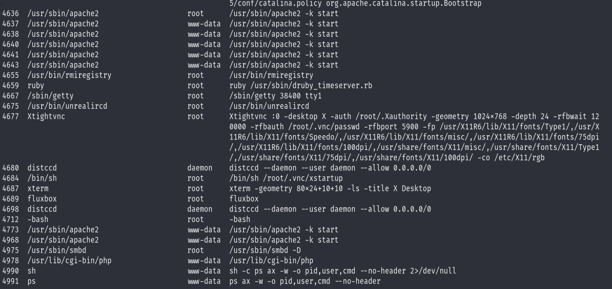

# Web-Server-Enumeration-and-Exploitation

This lab demonstrates performing active reconnaissance and exploitation on a web server. This demonstration involves the use of a Kali Linux and a Metasploitable2 VM in a virtualized network. 

## Active Reconnaissance with Nmap

## Active Reconnaissance using whatweb, curl, netcat and Metasploit

## Preparing Exploitation

### Generating Payload with msfvenom and uploading payload to web server

### Starting a reverse handler

### Executing the payload on the web server through a browser in the dav folder

### Reverse shell on web server established

### Post Exploitation Reconnaissance

